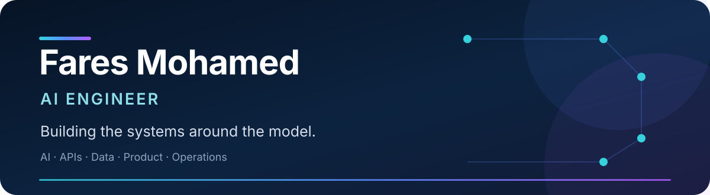

  

  <a href="mailto:faresmohamed260@gmail.com"><strong>Email</strong></a> &nbsp;•&nbsp;
  <a href="https://www.linkedin.com/in/fares-mohamed-b83454194/"><strong>LinkedIn</strong></a> &nbsp;•&nbsp;
  <a href="https://huggingface.co/faresmohamed260"><strong>Hugging Face</strong></a> &nbsp;•&nbsp;
  <a href="https://www.kaggle.com/faresmohamed260"><strong>Kaggle</strong></a>

  Alexandria, Egypt &nbsp;·&nbsp; B.Sc. Computer Science, 2026 &nbsp;·&nbsp; Open to AI/ML Engineering roles

## Selected work

Durable, server-owned image and video workflows with retries, cancellation, idempotent finalization, owner-scoped access, and persistent media.

**Next.js · TypeScript · Supabase · PostgreSQL · R2 · Modal · ComfyUI** 
[Live product](https://renderlab.faresuniform.uk) · [Repository](https://github.com/faresmohamed260/renderlab) · [Architecture](https://github.com/faresmohamed260/renderlab/tree/main/docs/architecture) · [Security](https://github.com/faresmohamed260/renderlab/blob/main/SECURITY.md)

 

Local-first narrative analysis that preserves source evidence, provenance, uncertainty, and the boundary between experimental results and production defaults.

**Python · FastAPI · Next.js · PostgreSQL · SQLAlchemy · Alembic · B2** 
[Repository](https://github.com/faresmohamed260/saga) · [Current status](https://github.com/faresmohamed260/saga/blob/main/PROJECT.md) · [Evaluation](https://github.com/faresmohamed260/saga/blob/main/docs/validation/PHASE_V2_3_COMPONENT_SCORECARD.md)

 

Arabic/English business software spanning retail, preorders, deposits, production demand, inventory, delegated access, recovery, and observability.

**Odoo · Python · Next.js · TypeScript · PostgreSQL · Playwright · GitHub Actions** 
[Staging](https://fares-uniform.vercel.app) · [Repository](https://github.com/faresmohamed260/fares-uniform) · [Business requirements](https://github.com/faresmohamed260/fares-uniform/blob/main/docs/requirements/DISCOVERY.md)

 

An ESP32 robot-arm system with persistent calibration, controller mapping, sequence recording, FK/IK path planning, and guarded physical execution.

**ESP32 · C++ · Python · FK/IK · Motion planning · Streamlit · ROS2 interfaces** 
[Repository](https://github.com/faresmohamed260/DUM-E) · [Setup and operation](https://github.com/faresmohamed260/DUM-E/blob/main/INSTALLATION.md)

## Toolkit

**Build** — Python, TypeScript, SQL, C/C++, React, Next.js, FastAPI, Odoo 
**AI** — PyTorch, NLP, LLM systems, RAG, evaluation, ComfyUI 
**Operate** — PostgreSQL, Supabase, Docker, GitHub Actions, Vercel, R2, B2, Modal 
**Verify** — pytest, Playwright, reproducible benchmarks, deployment and recovery checks

## Engineering principles

> **Measure before adopting.** Reproducible evaluation over impressive demos.

> **Design for failure.** Durable state, retries, idempotency, authorization, and recovery.

> **Ship the whole system.** Models connected to dependable products and operations.

Head of AI Committee at ElCoder · AI & Robotics Instructor and Content Creator at Engineering For Kids · Ranked at the top of my class at Alexandria University
