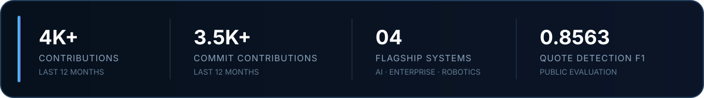
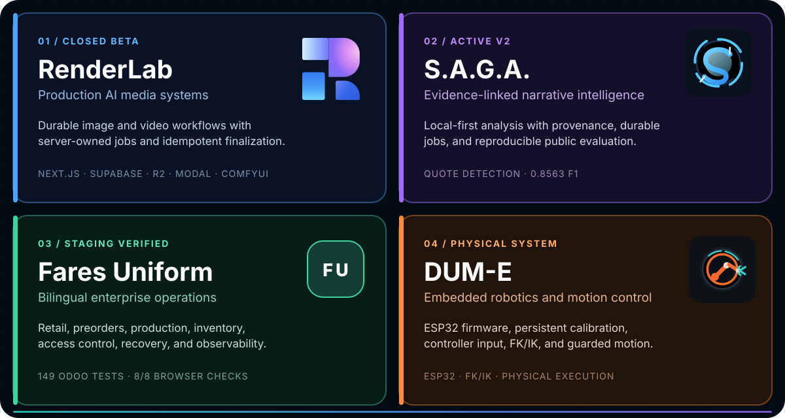
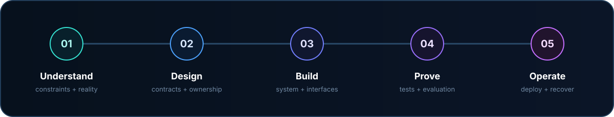

  

  <a href="mailto:faresmohamed260@gmail.com"><strong>Email</strong></a> &nbsp;·&nbsp;
  <a href="https://www.linkedin.com/in/fares-mohamed-b83454194/"><strong>LinkedIn</strong></a> &nbsp;·&nbsp;
  <a href="https://huggingface.co/faresmohamed260"><strong>Hugging Face</strong></a> &nbsp;·&nbsp;
  <a href="https://www.kaggle.com/faresmohamed260"><strong>Kaggle</strong></a>

Alexandria, Egypt · B.Sc. Computer Science, 2026 · Open to AI/ML Engineering roles

## Selected systems

<picture>
  <source media="(max-width: 600px)" srcset="./assets/projects-mobile.svg" />
  
</picture>

<strong>Explore the systems and their evidence</strong>

### [RenderLab](https://github.com/faresmohamed260/renderlab) · Production AI media systems

Server-owned image and video workflows with bounded retries, cancellation, idempotent finalization, owner-scoped access, and durable media. [Live product](https://renderlab.faresuniform.uk) · [Architecture](https://github.com/faresmohamed260/renderlab/tree/main/docs/architecture) · [Security](https://github.com/faresmohamed260/renderlab/blob/main/SECURITY.md)

### [S.A.G.A.](https://github.com/faresmohamed260/saga) · Evidence-linked narrative intelligence

Local-first narrative analysis with source evidence, provenance, uncertainty, durable jobs, and reproducible evaluation. Its deterministic quote detector leads the measured comparison at **0.8563 F1**. [Current status](https://github.com/faresmohamed260/saga/blob/main/PROJECT.md) · [Evaluation](https://github.com/faresmohamed260/saga/blob/main/docs/validation/PHASE_V2_3_COMPONENT_SCORECARD.md)

### [Fares Uniform](https://github.com/faresmohamed260/fares-uniform) · Bilingual enterprise operations

Arabic/English business software spanning retail, preorders, production, inventory, delegated access, recovery, and observability—validated by **149 Odoo tests** and **8/8 browser checks**. [Staging](https://fares-uniform.vercel.app) · [Requirements](https://github.com/faresmohamed260/fares-uniform/blob/main/docs/requirements/DISCOVERY.md)

### [DUM-E](https://github.com/faresmohamed260/DUM-E) · Embedded robotics and motion control

An ESP32 robot-arm system with persistent calibration, controller mapping, sequence recording, forward/inverse kinematics, path planning, and guarded physical execution. [Setup and operation](https://github.com/faresmohamed260/DUM-E/blob/main/INSTALLATION.md)

## System range

| Build | Intelligence | Operate | Verify |
| --- | --- | --- | --- |
| Python · TypeScript · SQL · C/C++ | PyTorch · NLP · LLM systems · RAG · ComfyUI | PostgreSQL · Supabase · Docker · Vercel · R2 · B2 · Modal | pytest · Playwright · CI/CD · evaluation · recovery |

## How I work

Head of AI Committee at ElCoder · AI & Robotics Instructor at Engineering For Kids · Ranked at the top of my class at Alexandria University

