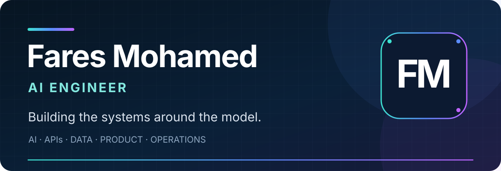
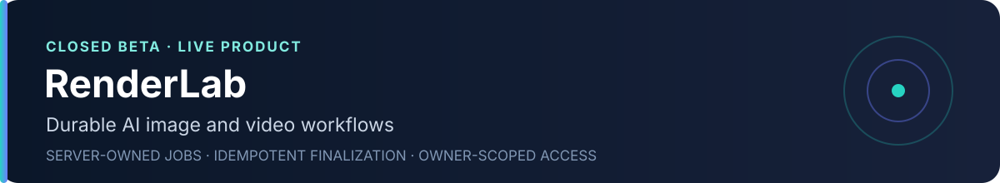
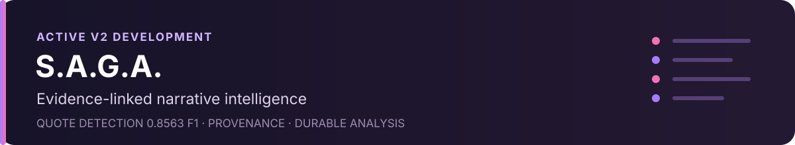
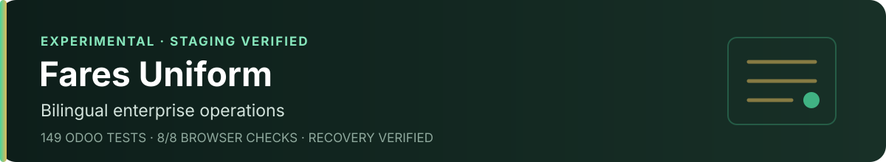
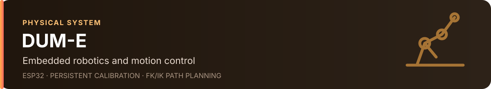

  

  <a href="mailto:faresmohamed260@gmail.com"><strong>Email</strong></a> &nbsp;•&nbsp;
  <a href="https://www.linkedin.com/in/fares-mohamed-b83454194/"><strong>LinkedIn</strong></a> &nbsp;•&nbsp;
  <a href="https://huggingface.co/faresmohamed260"><strong>Hugging Face</strong></a> &nbsp;•&nbsp;
  <a href="https://www.kaggle.com/faresmohamed260"><strong>Kaggle</strong></a>

  Alexandria, Egypt &nbsp;·&nbsp; B.Sc. Computer Science, 2026 &nbsp;·&nbsp; Open to AI/ML Engineering roles

  <strong>0.8563 F1</strong> quote detection &nbsp;·&nbsp;
  <strong>149</strong> Odoo tests &nbsp;·&nbsp;
  <strong>8/8</strong> browser checks &nbsp;·&nbsp;
  AI, enterprise software, and robotics

## Selected systems

Server-owned jobs, bounded retries, idempotent finalization, owner-scoped access, and durable media. 
`Next.js` `TypeScript` `Supabase` `PostgreSQL` `R2` `Modal` · [Live product](https://renderlab.faresuniform.uk) · [Architecture](https://github.com/faresmohamed260/renderlab/tree/main/docs/architecture)

 

Local-first analysis that preserves evidence, provenance, uncertainty, and measured adoption boundaries. 
`Python` `FastAPI` `Next.js` `PostgreSQL` `SQLAlchemy` `B2` · [Current status](https://github.com/faresmohamed260/saga/blob/main/PROJECT.md) · [Evaluation](https://github.com/faresmohamed260/saga/blob/main/docs/validation/PHASE_V2_3_COMPONENT_SCORECARD.md)

 

Arabic/English operations across retail, preorders, production, inventory, access control, recovery, and observability. 
`Odoo` `Python` `Next.js` `TypeScript` `PostgreSQL` `Playwright` · [Staging](https://fares-uniform.vercel.app) · [Requirements](https://github.com/faresmohamed260/fares-uniform/blob/main/docs/requirements/DISCOVERY.md)

 

Physical control with persistent calibration, controller mapping, sequence recording, FK/IK planning, and guarded execution. 
`ESP32` `C++` `Python` `FK/IK` `Streamlit` `ROS2` · [Setup and operation](https://github.com/faresmohamed260/DUM-E/blob/main/INSTALLATION.md)

## Across the stack

**Build** — Python, TypeScript, SQL, C/C++, React, Next.js, FastAPI, Odoo 
**AI** — PyTorch, NLP, LLM systems, RAG, evaluation, ComfyUI 
**Operate** — PostgreSQL, Supabase, Docker, GitHub Actions, Vercel, R2, B2, Modal 
**Verify** — pytest, Playwright, reproducible benchmarks, deployment and recovery checks

## How I work

1. **Measure before adopting** — reproducible evaluation over impressive demos.
2. **Design for failure** — durable state, retries, idempotency, authorization, and recovery.
3. **Ship the whole system** — models connected to dependable products and operations.

---

Head of AI Committee at ElCoder · AI & Robotics Instructor at Engineering For Kids · Ranked at the top of my class at Alexandria University

